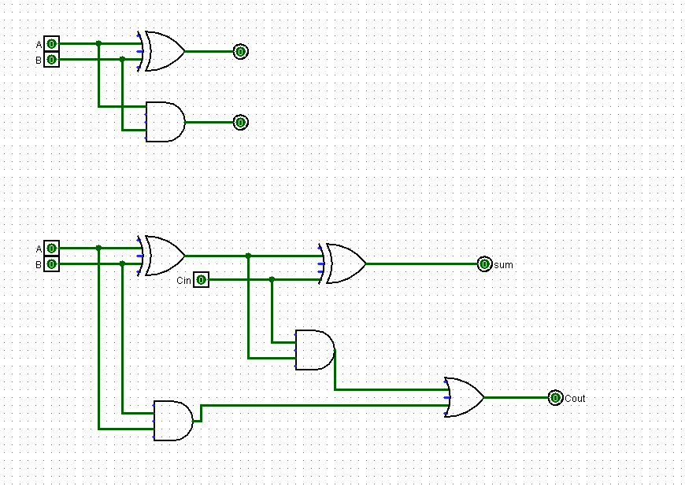
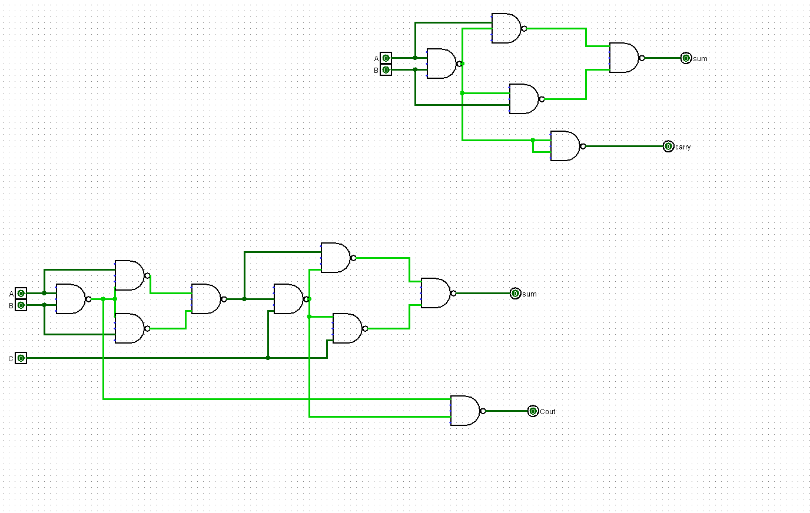

# Experiment 1: Implementation of Adders using Logic Gates (Logisim)

## Author
Anshika Bharti
241210019

---

## Aim

To design and simulate Half Adder and Full Adder circuits using basic logic gates and using only NAND gates in Logisim.

---

## Theory

Adders are basic digital circuits used to perform binary addition. They are widely used in computers and digital systems for arithmetic operations.

### Half Adder

A Half Adder adds two single-bit inputs (A and B).
It produces:

* Sum (S) = A XOR B
* Carry (C) = A AND B

It does not take any input carry.

---

### Full Adder

A Full Adder adds three inputs:

* A, B (input bits)
* Cin (carry from previous stage)

It produces:

* Sum (S) = A XOR B XOR Cin
* Carry (Cout) = (A AND B) OR (Cin AND (A XOR B))

This is used for multi-bit addition.

---

### Adders using NAND Gates

NAND is a universal gate, which means any digital circuit can be implemented using only NAND gates.
In this experiment, Half Adder and Full Adder circuits are also designed using only NAND gates to verify this concept.

---

## Tools Used

* Logisim (Digital Circuit Simulator)

---

## Procedure

1. Open Logisim and create a new circuit.
2. Design Half Adder using XOR and AND gates.
3. Verify output using all input combinations.
4. Design Full Adder using basic gates.
5. Implement the same circuits using only NAND gates.
6. Test and verify outputs with truth tables.

---

## Observations

The outputs obtained from the circuits match the expected results of Half Adder and Full Adder truth tables.

---

## Result

Half Adder and Full Adder circuits were successfully implemented using:

* Basic logic gates
* NAND gates only

The outputs were verified and found to be correct.

---

## Files Included

* adders.circ → Half Adder and Full Adder using basic gates
* addersUsingNAND.circ → Adders using NAND gates

---

## Screenshots

### Half Adder

### Full Adder

---

## Applications

* Arithmetic operations in processors
* Arithmetic Logic Unit (ALU)
* Digital systems and embedded systems

---

## Note

This experiment helps in understanding how arithmetic operations are implemented at the hardware level and demonstrates the use of NAND as a universal gate.
