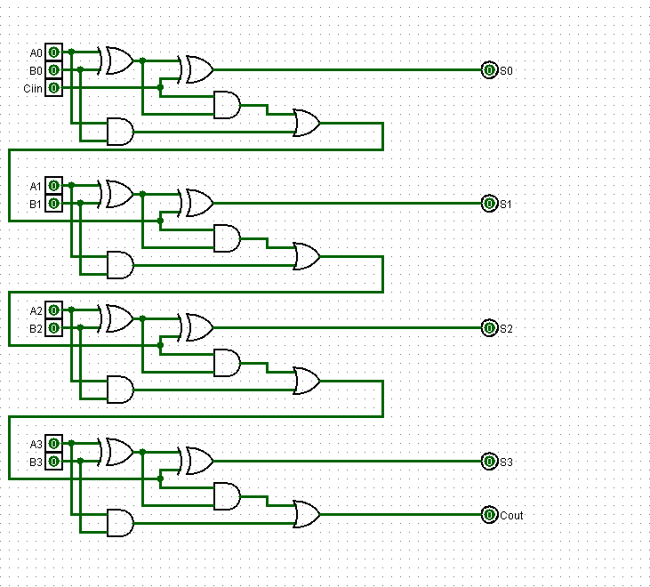

# Experiment: Design and Implementation of a 4-Bit Ripple Carry Adder in Logisim

## Aim

To design and simulate a 4-bit ripple carry adder using Full Adders in Logisim.

## Author
Anshika Bharti
241210019

---

## Theory

A Ripple Carry Adder (RCA) is a digital circuit used to perform binary addition. It is constructed by connecting multiple Full Adders in series. The carry output from each stage is passed as input to the next stage, which results in a sequential propagation of carry.

### Full Adder

A Full Adder is a combinational circuit that adds three input bits:

* A (input bit)
* B (input bit)
* Cin (carry input)

It produces:

* Sum (S) = A XOR B XOR Cin
* Carry (Cout) = (A AND B) OR (Cin AND (A XOR B))

---

### 4-Bit Ripple Carry Adder

A 4-bit ripple carry adder is formed by connecting four Full Adders:

* The first stage adds the least significant bits (A0, B0) along with the initial carry (Cin).
* Each subsequent stage takes the carry output from the previous stage as its input.
* The final output consists of four sum bits (S3, S2, S1, S0) and a carry output (Cout).

Carry propagation:
FA0 → FA1 → FA2 → FA3

This step-by-step movement of carry is known as ripple carry.

---

## Tools Used

* Logisim (Digital Circuit Simulator)

---

## Procedure

1. Open Logisim and create a new circuit.
2. Design a Full Adder using logic gates or built-in components.
3. Connect four Full Adders in sequence.
4. Provide inputs A3–A0 and B3–B0.
5. Set the initial carry input (Cin) to 0.
6. Observe outputs S3–S0 and final carry Cout.
7. Verify the circuit using different input combinations.

---

## Observations

The outputs obtained from the circuit were verified for multiple input combinations and were found to be correct according to binary addition.

---

## Result

The 4-bit ripple carry adder was successfully designed and implemented in Logisim. The circuit performed correct binary addition, and the results matched the expected outputs.

---

## Screenshots

### Ripple carry Adder

---

## Applications

* Arithmetic Logic Unit (ALU)
* Digital systems and processors
* Binary addition operations

---

## Conclusion

The experiment successfully demonstrated the design and working of a 4-bit ripple carry adder. It helped in understanding how carry propagates through multiple stages and how multi-bit addition is achieved in digital circuits.
