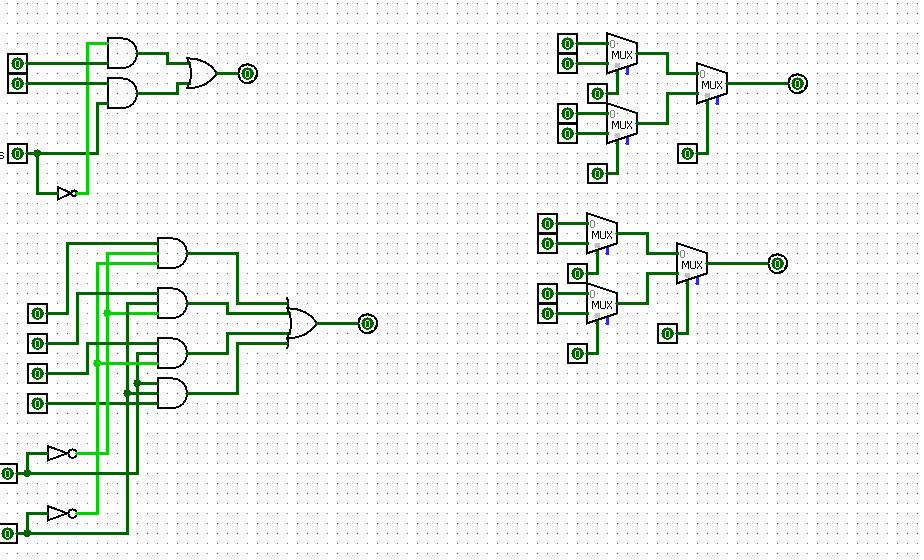

# Experiment: Design and Implementation of 2×1 and 4×1 Multiplexers in Logisim

## Aim

To design and simulate 2×1 and 4×1 multiplexers using logic gates in Logisim.

## Author

Anshika Bharti
241210019

---

## Theory

A Multiplexer (MUX) is a combinational circuit that selects one input from multiple inputs and forwards it to a single output line based on the selection inputs.

---

### 2×1 Multiplexer

A 2×1 MUX has:

* 2 input lines (I0, I1)
* 1 select line (S)
* 1 output (Y)

Operation:

* If S = 0 → Y = I0
* If S = 1 → Y = I1

Boolean Expression:

* Y = (I0 · S̅) + (I1 · S)

---

### 4×1 Multiplexer

A 4×1 MUX has:

* 4 input lines (I0, I1, I2, I3)
* 2 select lines (S1, S0)
* 1 output (Y)

Operation:

* S1S0 = 00 → Y = I0
* S1S0 = 01 → Y = I1
* S1S0 = 10 → Y = I2
* S1S0 = 11 → Y = I3

Boolean Expression:

* Y = (I0 · S1̅ · S0̅) + (I1 · S1̅ · S0) + (I2 · S1 · S0̅) + (I3 · S1 · S0)

---

## Tools Used

* Logisim (Digital Circuit Simulator)

---

## Procedure

1. Open Logisim and create a new circuit.
2. Design a 2×1 MUX using basic logic gates.
3. Verify its output for both values of select line.
4. Design a 4×1 MUX using logic gates or by combining 2×1 MUX units.
5. Provide inputs and select lines.
6. Observe and verify the output for all input combinations.

---

## Observations

The output of the multiplexers changed correctly according to the select lines, matching the expected behavior.

---

## Result

The 2×1 and 4×1 multiplexers were successfully designed and simulated in Logisim. The outputs were verified and found to be correct.

---

## Screenshots

### Mux

---

## Applications

* Data selection in digital systems
* Communication systems
* Implementation of combinational logic

---

## Conclusion

The experiment demonstrated the working of multiplexers as data selectors. It provided a clear understanding of how multiple inputs can be controlled and selected using select lines in digital circuits.
