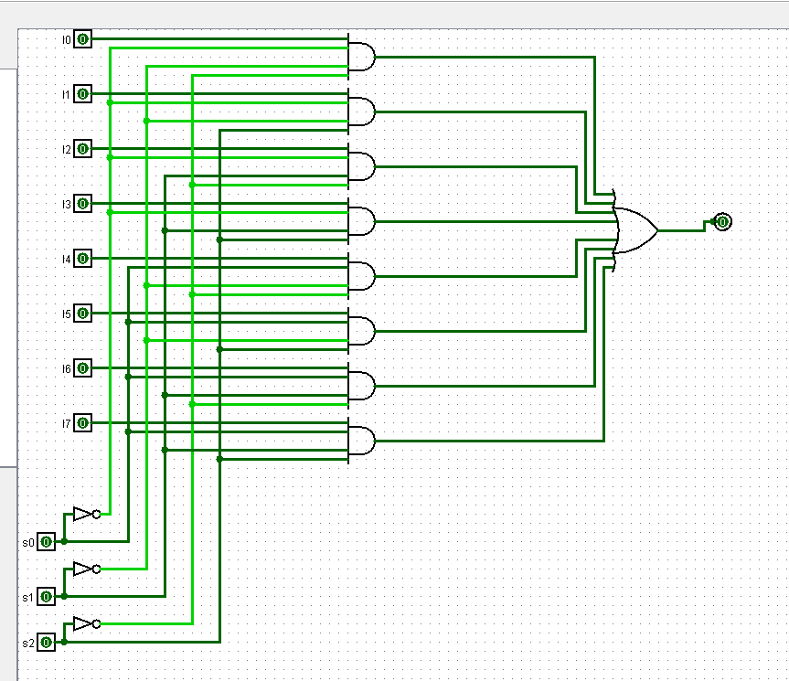

# Experiment: Design and Implementation of 8×1 Multiplexer in Logisim

## Aim

To design and simulate an 8×1 multiplexer using logic gates in Logisim.

## Author

Your Name
Anshika Bharti
241210019

---

## Theory

A Multiplexer (MUX) is a combinational circuit that selects one input from multiple input lines and forwards it to a single output line based on select inputs.

---

### 8×1 Multiplexer

An 8×1 MUX has:

* 8 input lines (I0, I1, I2, I3, I4, I5, I6, I7)
* 3 select lines (S2, S1, S0)
* 1 output (Y)

The select lines determine which input is connected to the output.

---

### Operation

| S2 | S1 | S0 | Output (Y) |
| -- | -- | -- | ---------- |
| 0  | 0  | 0  | I0         |
| 0  | 0  | 1  | I1         |
| 0  | 1  | 0  | I2         |
| 0  | 1  | 1  | I3         |
| 1  | 0  | 0  | I4         |
| 1  | 0  | 1  | I5         |
| 1  | 1  | 0  | I6         |
| 1  | 1  | 1  | I7         |

---

### Boolean Expression

Y = (I0 · S2̅ · S1̅ · S0̅)
  + (I1 · S2̅ · S1̅ · S0)
  + (I2 · S2̅ · S1 · S0̅)
  + (I3 · S2̅ · S1 · S0)
  + (I4 · S2 · S1̅ · S0̅)
  + (I5 · S2 · S1̅ · S0)
  + (I6 · S2 · S1 · S0̅)
  + (I7 · S2 · S1 · S0)

---

## Tools Used

* Logisim (Digital Circuit Simulator)

---

## Procedure

1. Open Logisim and create a new circuit.
2. Design the circuit using basic logic gates or by combining smaller multiplexers.
3. Provide 8 input lines and 3 select lines.
4. Connect the circuit according to the Boolean expression.
5. Observe the output for different combinations of select inputs.
6. Verify that the output matches the selected input.

---

## Observations

The output was observed for different select line combinations and was found to match the expected input selection.

---

## Result

The 8×1 multiplexer was successfully designed and simulated in Logisim. The circuit correctly selected one input out of eight based on the select lines.

---

## Screenshots

### 8x1 Mux

---

## Applications

* Data selection in digital systems
* Communication systems
* Signal routing and control

---

## Conclusion

The experiment demonstrated the working of an 8×1 multiplexer and how multiple inputs can be efficiently selected using select lines. It helped in understanding data selection mechanisms in digital circuits.
