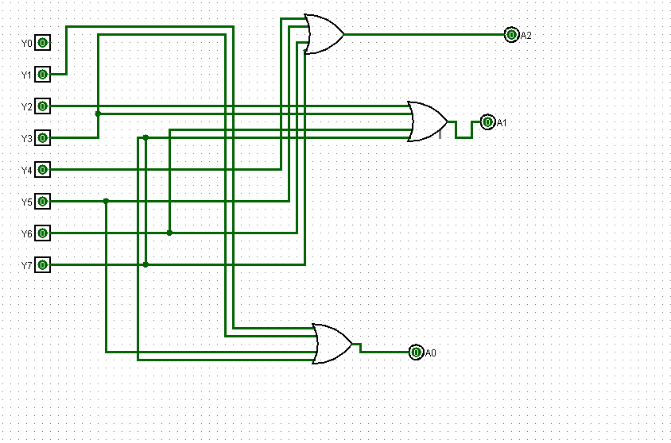

# Experiment: Design and Implementation of 8×3 Encoder in Logisim

## Aim

To design and simulate an 8×3 encoder using logic gates in Logisim.

## Author

Anshika Bharti
241210019

---

## Theory

An Encoder is a combinational circuit that converts multiple input lines into a smaller number of output lines. It performs the reverse operation of a decoder.

An 8×3 encoder has 8 input lines and 3 output lines. It converts the active input into its corresponding binary code.

---

### 8×3 Encoder

* Inputs: I0, I1, I2, I3, I4, I5, I6, I7
* Outputs: Y2, Y1, Y0

At any time, only one input line is assumed to be active (logic 1).

---

### Truth Table

| Active Input | Y2 | Y1 | Y0 |
| ------------ | -- | -- | -- |
| I0 = 1       | 0  | 0  | 0  |
| I1 = 1       | 0  | 0  | 1  |
| I2 = 1       | 0  | 1  | 0  |
| I3 = 1       | 0  | 1  | 1  |
| I4 = 1       | 1  | 0  | 0  |
| I5 = 1       | 1  | 0  | 1  |
| I6 = 1       | 1  | 1  | 0  |
| I7 = 1       | 1  | 1  | 1  |

---

### Boolean Expressions

* Y2 = I4 + I5 + I6 + I7
* Y1 = I2 + I3 + I6 + I7
* Y0 = I1 + I3 + I5 + I7

---

## Tools Used

* Logisim (Digital Circuit Simulator)

---

## Procedure

1. Open Logisim and create a new circuit.
2. Provide 8 input lines and 3 output lines.
3. Implement the Boolean expressions using OR gates.
4. Connect the inputs to generate the corresponding binary outputs.
5. Test the circuit by activating one input at a time.
6. Verify that the output matches the expected binary code.

---

## Observations

The outputs obtained corresponded correctly to the binary representation of the active input line.

---

## Result

The 8×3 encoder was successfully designed and implemented in Logisim. The circuit correctly converted active input signals into corresponding binary outputs.

---

## Screenshots

### Encoder

---

## Applications

* Data encoding in digital systems
* Keyboard encoding
* Communication systems

---

## Conclusion

The experiment demonstrated the working of an 8×3 encoder and how multiple input lines can be converted into a smaller set of binary outputs, improving efficiency in digital systems.
