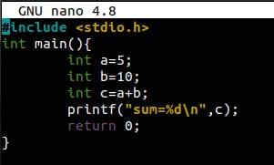
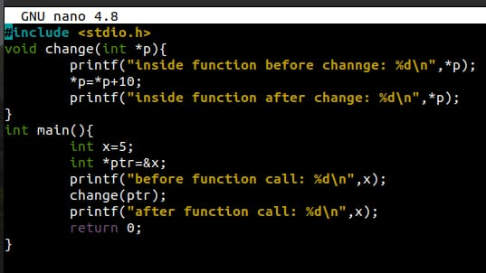

# Experiment: Program Execution Analysis Using GDB Compiler

## Aim

To study and analyze the execution of a program in memory using the GNU Debugger (GDB).

## Author

Anshika Bharti
241210019

---

## Theory

The GNU Debugger (GDB) is a tool used to debug programs written in languages such as C and C++. It allows users to observe how a program executes, examine memory contents, and control the flow of execution.

Using GDB, we can:

* Execute a program step-by-step
* Inspect variable values
* View memory addresses
* Set breakpoints to pause execution
* Analyze how instructions are executed in memory

This helps in understanding the internal working of programs and identifying logical or runtime errors.

---

## Tools Used

* GCC Compiler
* GDB Debugger
* Linux Terminal / Command Prompt

---

## Procedure

1. Write a simple C program (e.g., addition or variable operations).
2. Compile the program with debugging option:

   ```
   gcc -g program.c -o program
   ```
3. Start GDB:

   ```
   gdb program
   ```
4. Set a breakpoint at the main function:

   ```
   break main
   ```
5. Run the program:

   ```
   run
   ```
6. Execute the program step-by-step:

   ```
   next
   ```
7. Display variable values:

   ```
   print variable_name
   ```
8. View memory address:

   ```
   print &variable_name
   ```
9. Continue execution:

   ```
   continue
   ```
10. Exit GDB:

```
quit
```

---

## Observations

* The program execution was traced step-by-step using GDB.
* Variable values were successfully monitored during execution.
* Memory addresses of variables were observed and analyzed.
* Breakpoints helped in pausing execution at specific points.

---

## Result

The program execution was successfully analyzed using GDB. The memory locations and variable values were observed, providing a clear understanding of how the program runs internally.

---

## Screenshots

(Add your screenshots here)

### Code Execution




### Output and Debugging


---

## Applications

* Debugging programs
* Analyzing memory usage
* Understanding program execution flow
* Identifying logical and runtime errors

---

## Conclusion

This experiment helped in understanding how a program executes in memory using GDB. It provided practical knowledge of debugging techniques, including breakpoints, step execution, and memory inspection.
