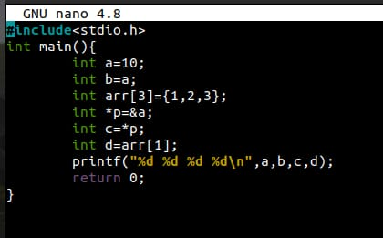
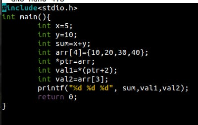
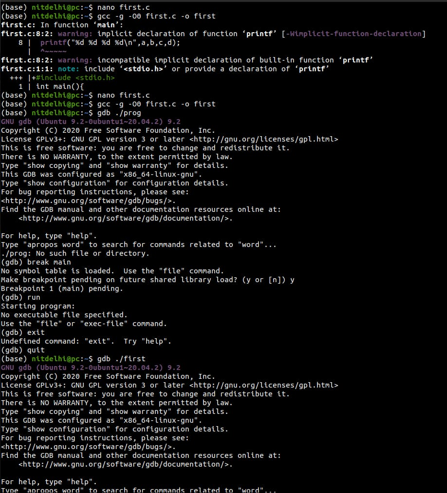
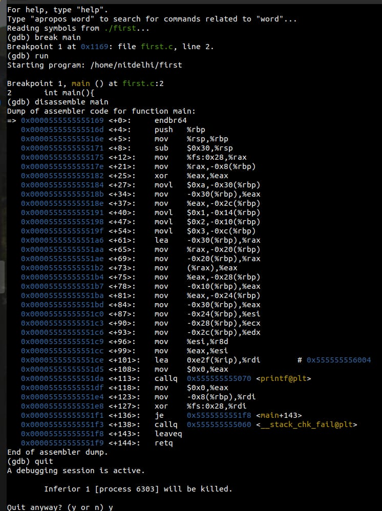
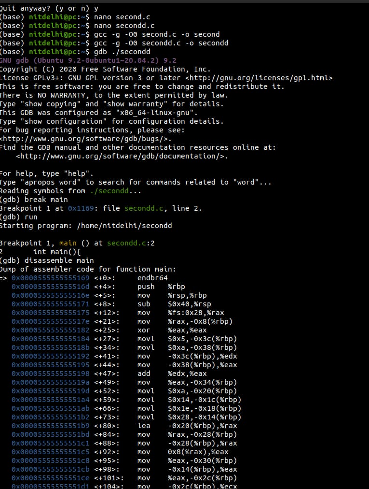
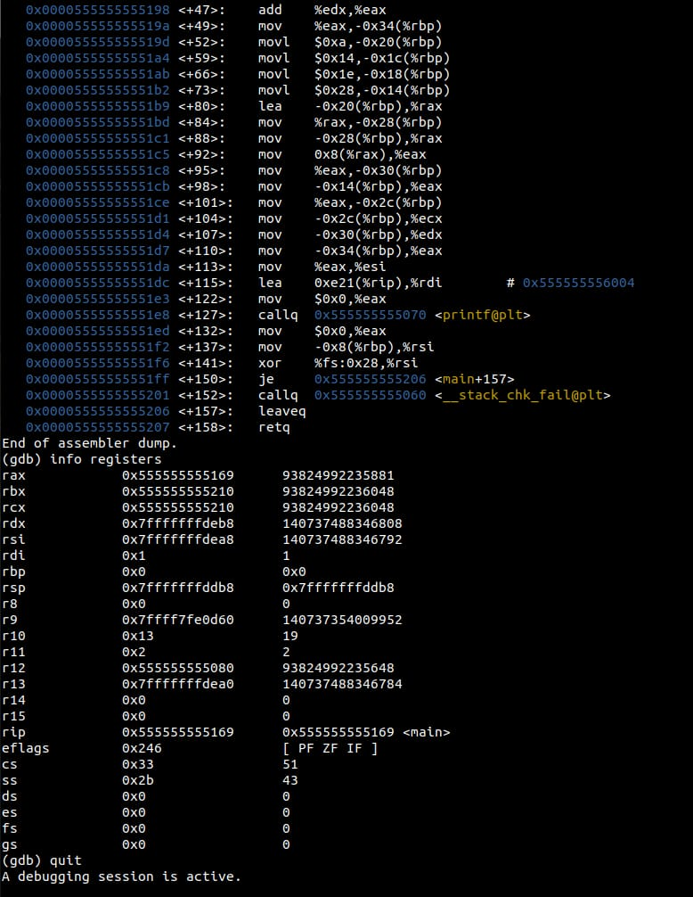

# Experiment: Demonstration of Addressing Modes Using GDB

## Aim

To study and demonstrate different addressing modes of instructions by analyzing the execution of a C program using GDB.

## Author

Anshika Bharti
241210019

---

## Theory

Addressing modes define how the operands of an instruction are specified in a program. They determine how data is accessed during execution.

Using the GNU Debugger (GDB), we can observe how variables are stored in memory and how different addressing modes are applied during program execution.

---

### Types of Addressing Modes

#### 1. Immediate Addressing Mode

In this mode, the operand is a constant value directly specified in the instruction.
Example:

```
int a = 5;
```

---

#### 2. Direct Addressing Mode

The instruction directly specifies the memory address of the operand.
Example:

```
int a = 10;
int b = a;
```

---

#### 3. Indirect Addressing Mode

The address of the operand is stored in another variable (pointer).
Example:

```
int a = 10;
int *p = &a;
```

---

#### 4. Register Addressing Mode

Operands are stored in CPU registers and operations are performed directly on them.
(In C, this is handled internally by the compiler.)

---

#### 5. Indexed Addressing Mode

The effective address is obtained by adding a base address and an index.
Example:

```
int arr[3] = {1, 2, 3};
```

---

## Tools Used

* GCC Compiler
* GDB Debugger
* Linux Terminal / Command Prompt

---

## Procedure

1. Write a C program demonstrating different addressing modes.
2. Compile the program with debugging option:

   ```
   gcc -g program.c -o program
   ```
3. Start GDB:

   ```
   gdb program
   ```
4. Set breakpoint at main:

   ```
   break main
   ```
5. Run the program:

   ```
   run
   ```
6. Execute step-by-step:

   ```
   next
   ```
7. Observe variable values:

   ```
   print variable_name
   ```
8. View memory addresses:

   ```
   print &variable_name
   ```
9. Analyze pointer values:

   ```
   print *pointer_name
   ```
10. Continue execution:

```
continue
```

11. Exit:

```
quit
```

---

## Observations

* Immediate values were directly assigned and observed.
* Memory addresses of variables were displayed using GDB.
* Pointer variables were used to access data indirectly.
* Array elements demonstrated indexed addressing.
* Step-by-step execution helped in understanding data access methods.

---

## Result

Different addressing modes were successfully demonstrated using GDB. The behavior of variables and memory access patterns were clearly observed during program execution.

---

## Screenshots

### Code




### Execution and Output






---

## Applications

* Understanding instruction execution
* Debugging and program analysis
* Memory management concepts
* System-level programming

---

## Conclusion

This experiment provided a clear understanding of different addressing modes and how they are used to access data in a program. Using GDB made it easier to visualize memory locations and analyze program execution step-by-step.
