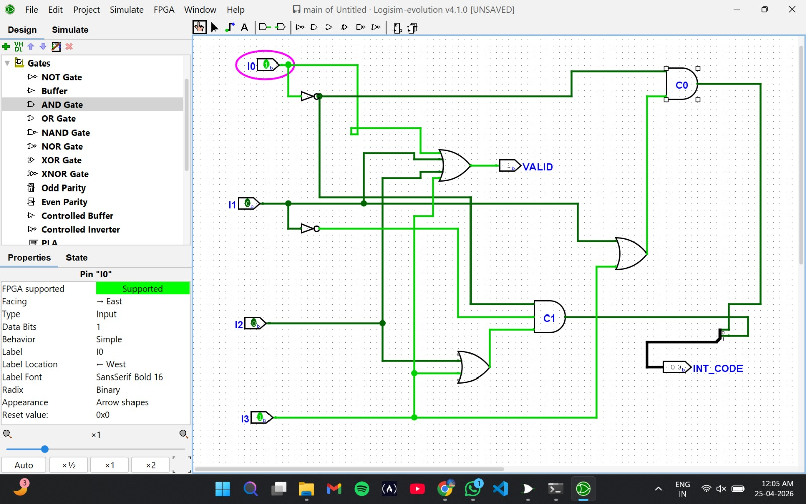

Experiment: Design and Implementation of 4-Bit Common Bus Architecture

Aim

To design and simulate a 4-bit common bus architecture using multiplexers in Logisim.

Author

Anshika Bharti
241210019

---

Theory

A Common Bus Architecture is used to transfer data between multiple registers using a shared communication path called a bus. Instead of connecting each register individually, a common bus reduces hardware complexity and improves efficiency.

In a 4-bit common bus system:

- Each register is 4 bits wide
- Data from one register can be transferred to another through the bus
- Selection lines determine which register places its data onto the bus

---

Bus Structure

A common bus can be implemented using multiplexers.

- For a 4-bit bus, four multiplexers are required (one for each bit)
- Each multiplexer selects one bit from multiple registers
- The selected outputs form the bus

---

Working

- Multiple registers (e.g., R0, R1, R2, R3) are connected to the bus
- Selection lines (S1, S0) control which register is connected to the bus
- The selected register’s data appears on the bus output
- This data can then be transferred to another register

---

Advantages

- Reduces the number of connections
- Efficient data transfer between registers
- Simplifies circuit design

---

Tools Used

- Logisim (Digital Circuit Simulator)

---

Procedure

1. Open Logisim and create a new circuit.
2. Create multiple 4-bit registers (R0, R1, R2, R3).
3. Use multiplexers to implement the common bus (one multiplexer per bit).
4. Connect outputs of all registers to the multiplexers.
5. Provide selection lines to choose the register.
6. Observe the bus output for different selection inputs.
7. Verify that the correct register data appears on the bus.

---

Observations

The data from the selected register was successfully transferred to the bus based on the selection lines. The outputs matched the expected values.

---

Result

The 4-bit common bus architecture was successfully designed and implemented in Logisim. The circuit correctly transferred data between registers using a shared bus.

---

Screenshots

### 4 bit Common Bus Architecture

---

Applications

- Computer organization and architecture
- Data transfer between registers
- Processor design

---

Conclusion

The experiment demonstrated the working of a 4-bit common bus architecture and showed how multiple registers can share a common communication path for efficient data transfer.
